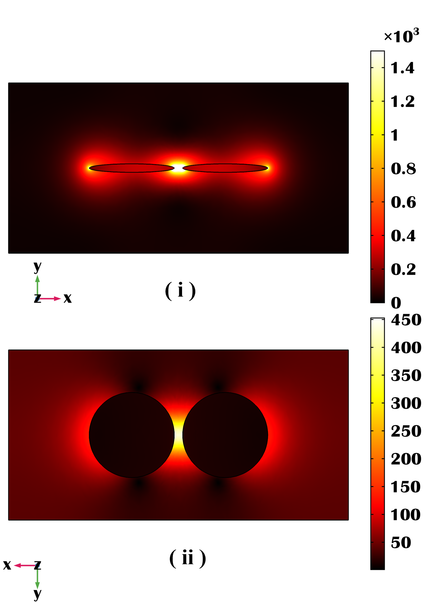
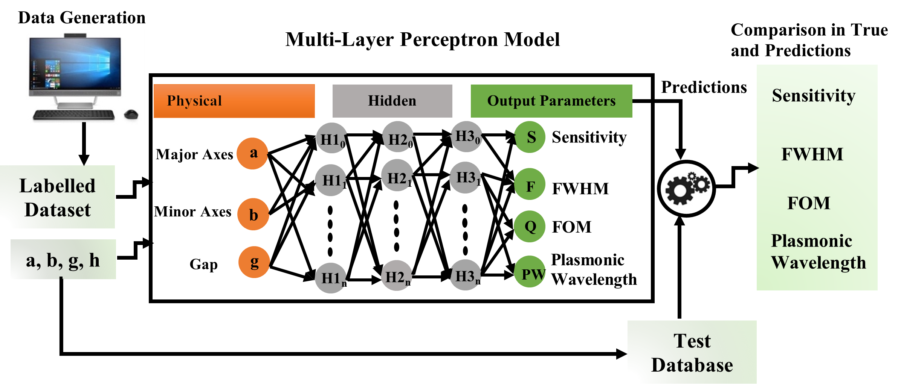

<table align="center">
<tr><td align="center" width="10000">

 

    
    

  
# <strong> Quantification-of-nanosensor-Properties </strong>
This code introduces a novel method for designing and optimizing electromagnetic plasmonic nanostructures using Artificial Neural Networks (ANNs), which have gained popularity in tackling complex data-driven problems efficiently. 

In this study, we leverage a computationally efficient approach based on ANNs to predict crucial parameters such as sensitivity (S), Full Width Half Maximum (FWHM), Figure of Merit (FOM), and Plasmonic Wavelength (PW) for different paired nanostructures. Initially, nanostructure simulations are conducted using the Finite Element Method (FEM) to gather the dataset. Input parameters including the Major axis (a), Minor axis (b), and separation gap (g) are utilized to calculate corresponding sensitivity (nm/RIU), FWHM (nm), FOM, and plasmonic wavelength (nm), thereby forming the dataset.

Subsequently, we design the neural network architecture, optimizing the number of hidden layers and neurons through comprehensive analysis to enhance the ML model's efficiency. Once the neural network is optimized, it is employed to predict outputs for specific inputs, enabling efficient modeling of nanostructure behavior. Moreover, this article evaluates the prediction accuracy by comparing the error between predicted and simulated results, demonstrating the superior performance of our approach over direct numerical simulation methods in forecasting output for various input device parameters.

